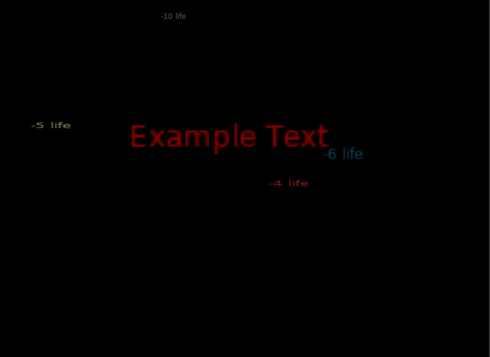

# Love2D-Floating-Text
Provides an easy and efficient interface for animated floating text for Love2D
```lua
PopupTextManagerInstance:addPopup(
    {
        text = "Example Text",
        color = {r = 1, g = 0, b = 0, a = 1},
        x = 200,
        y = 200,
        scaleX = 4,
        scaleY = 4,
        fadeIn = {start = 0.2, finish = 0.7},
        fadeOut = {start = 0.7, finish = 2},
        dX = 40,
        dY = 40,
        duration = 2
    })
```



More examples can be found at main.lua

## Features
- Input a Class base for PopupTextManager
- Use your own render function
- Move by parameters
- Circular Motion
- Fade In and Fade Out
- Blend Modes, Scaling, Rotation, Time on Screen
- Add your own font to the text

## To Do
- Add a rotate by
- Add a scale by

## How to
- Download class.lua, PopupText.lua, PopupTextManager.lua
- Include it by adding onto the top of your main `Class = require 'class'`, then `require 'PopupText'`, then `require 'PopupTextManager'`
- Set it updating and rendering

## Thanks
- Thanks to Matthias Richter for providing class.lua file

## Short Example

```lua
--Author: Marcelo Silva Nascimento Mancini
--Example of how to use
--Github: github.com/MrcSnm
--06/03/2020
Class = require 'lib/class'
require 'lib/effects/PopupText'
require 'lib/effects/PopupTextManager'

function love.load()
    gPopupManager = PopupTextManager()--Popup Classbase, Render function
    gPopupManager:addPopup(
    {
        text = "Example Text",
        font = anyFont
        color = {r = 1, g = 0, b = 0, a = 1},
        x = 200,
        y = 200,
        scaleX = 4,
        scaleY = 4,
        circular = {totalAngle = math.pi, radiusX = 40, radiusY = 40}
        blendMode = 'add',
        fadeIn = {start = 0.2, finish = 0.7},
        fadeOut = {start = 0.7, finish = 2},
        dX = 40,
        dY = 40,
        duration = 2
    })
end

function love.update(dt)
    gPopupManager:update(dt)
end

function love.draw()
    gPopupManager:render()
end

```
